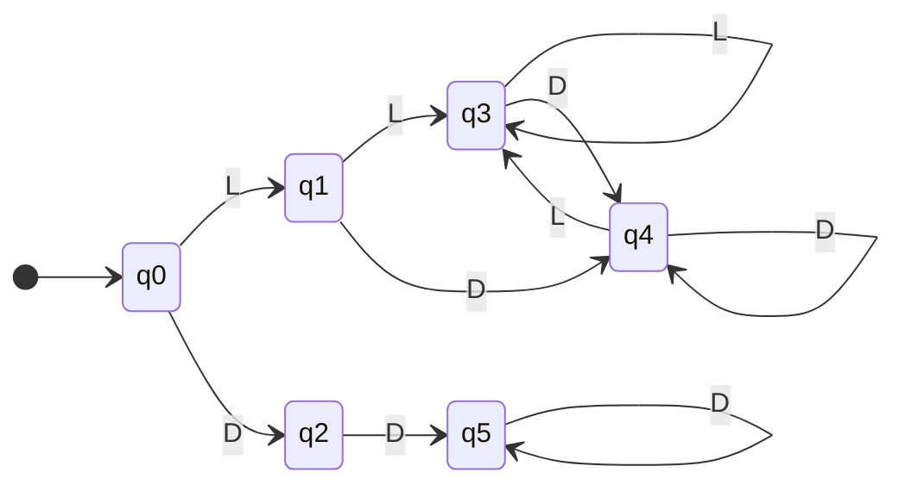

```mermaid
stateDiagram-v2
    direction LR
    classDef accept fill:#e2f0e2,stroke:#333,stroke-width:2px;
    q1:::accept
    q2:::accept
    q3:::accept
    q4:::accept
    q5:::accept
    [*] --> q0
    q0 --> q1 : L
    q0 --> q2 : D
    q1 --> q3 : L
    q1 --> q4 : D
    q2 --> q5 : D
    q3 --> q3 : L
    q3 --> q4 : D
    q4 --> q3 : L
    q4 --> q4 : D
    q5 --> q5 : D
```